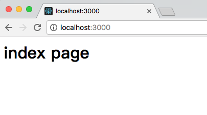
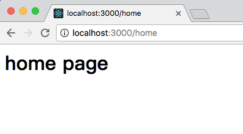
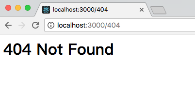

# 路由 koa-router

上一节我们学习了中间件的基本概念，本节主要带大家学习下 `koa-router` 路由中间件的使用方法。

路由是用于描述 `URL` 与处理函数之间的对应关系的。比如用户访问 `http://localhost:3000/`，那么浏览器就会显示 `index` 页面的内容，如果用户访问的是 `http://localhost:3000/home`，那么浏览器应该显示 `home` 页面的内容。

要实现上述功能，如果不借助 `koa-router` 或者其他路由中间件，我们自己去处理路由，那么写法可能如下所示：

```
const Koa = require('koa');

const app = new Koa();

app.use(async (ctx, next) => {
    if (ctx.request.path === '/') {
        ctx.response.body = '<h1>index page</h1>';
    } else {
        await next();
    }
});
app.use(async (ctx, next) => {
    if (ctx.request.path === '/home') {
        ctx.response.body = '<h1>home page</h1>';
    } else {
        await next();
    }
});
app.use(async (ctx, next) => {
    if (ctx.request.path === '/404') {
        ctx.response.body = '<h1>404 Not Found</h1>';
    } else {
        await next();
    }
});

app.listen(3000);
console.log('app started at port 3000...');
```

把上述代码复制并覆盖到 `app.js` 中，然后执行以下命令启动 `node` 程序:

```
nodemon app.js
```
启动之后在浏览器中分别访问 `http://localhost:3000/`、`http://localhost:3000/home`、`http://localhost:3000/404` 就能看到相应的页面了。

`nodemon` 是一个管理 `node` 应用的工具。它能够在我们修改 `node` 程序后自动重启，比较轻量而且用于本地调试十分方便。可以通过下面的命令来全局安装:
```
npm install nodemon -g
```

在产线上我们使用更多的工具是 `pm2`，它和 `nodemon` 类似，但是功能比较全面，大家可以自行搜索学习下。

上述 `app.js` 的代码中，由 `async` 标记的函数称为『异步函数』，在异步函数中，可以用 `await` 调用另一个异步函数，`async` 和 `await` 这两个关键字将在 ES7 中引入。参数 `ctx` 是由 `koa` 传入的，我们可以通过它来访问 `request` 和 `response`，`next` 是 `koa` 传入的将要处理的下一个异步函数。

**注意：由于 node 在 v7.6.0 中才支持 `async` 和 `await`，所以在运行 app.js 之前请确保 node 版本正确，或者使用一些第三方的 async 库来支持。**

这样的写法能够处理简单的应用，但是，一旦要处理的 `URL` 多起来的话就会显得特别笨重。所以我们可以借助 `koa-router` 来更简单的实现这一功能。
下面来介绍一下如何正确的使用 `koa-router`。

## 首先是安装 koa-router

通过 `npm` 命令直接安装：

```
npm install koa-router --save
```

`--save` 是为了安装完成之后能够在 `package.json` 的 `dependencies` 中保留 `koa-router`，以便于下次只需要执行 `npm install` 就能够安装所有需要的依赖包。

## 基本使用方法

如果要在 `app.js` 中使用 `koa-router` 来处理 `URL`，可以通过以下代码来实现：

```
const Koa = require('koa');

// 注意 require('koa-router') 返回的是函数
const router = require('koa-router')();

const app = new Koa();

// 添加路由
router.get('/', async (ctx, next) => {
    ctx.response.body = `<h1>index page</h1>`;
});

router.get('/home', async (ctx, next) => {
    ctx.response.body = '<h1>HOME page</h1>';
});

router.get('/404', async (ctx, next) => {
    ctx.response.body = '<h1>404 Not Found</h1>';
});

// 调用路由中间件
app.use(router.routes());

app.listen(3000);
console.log('app started at port 3000...');
```
运行 `app.js`:
```
nodemon app.js
```

**注意，如果发生报错，那么可能你的 node 版本还不支持 `async` 和 `await`，需要把 node 升级到 `v7.6.0` 以上，或者使用一些第三方的 async 库来支持。**

执行完上面的操作之后，我们在浏览器中访问 `http://localhost:3000/`：



在浏览器中访问 `http://localhost:3000/home`：



在浏览器中访问 `http://localhost:3000/404`：



通过上面的例子，我们可以看到和之前不使用 `koa-router` 的显示效果是一样的。不过使用了 `koa-router` 之后，代码稍微简化了一些，而且少了 `if` 判断，还有省略了 `await next()`（因为没有其他中间件需要执行，所以这里就先省略了）。

当然，除了 `GET` 方法，`koa-router` 也支持处理其他的请求方法，比如：

```
router
  .get('/', async (ctx, next) => {
    ctx.body = 'Hello World!';
  })
  .post('/users', async (ctx, next) => {
    // ... 
  })
  .put('/users/:id', async (ctx, next) => {
    // ... 
  })
  .del('/users/:id', async (ctx, next) => {
    // ... 
  })
  .all('/users/:id', async (ctx, next) => {
    // ... 
  });
```

在 HTTP 规范中，`GET`、`POST`、`PUT` 和 `DELETE` 分别对应`查`、`改`、`增`和`删`，这里 `router` 的方法也一一对应。通常我们使用 `GET` 来查询和获取数据；使用 `POST` 来更新资源；`PUT` 和 `DELETE` 使用比较少，但是如果你们团队比较注重规范和语义化，就比较推荐使用了。我们注意到，上述代码中还有一个 `all` 方法。`all` 方法用于处理上述方法无法匹配的情况，或者你不确定客户端发送的请求方法类型的情况。

举个例子，假设客户端使用 `jQuery` 来开发，有如下几个 `ajax` 请求：

```
// 优先匹配和 router.get 方法中 url 规则一样的请求，如果匹配不到的话就匹配和 router.all 方法中 url 规则一样的请求。
$.ajax({
  method: "GET",
  url: "some.php",
  data: { name: "John" }
}).done(function( msg ) {
  // do something 
});

// 优先匹配和 router.post 方法中 url 规则一样的请求，如果匹配不到的话就匹配和 router.all 方法中 url 规则一样的请求。
$.ajax({
  method: "POST",
  url: "some.php",
  data: { name: "John" }
}).done(function( msg ) {
  // do something 
});
```

上面例子中两个方法最主要的区别就是 `ajax` 中 `method` 的值，`method` 的值和 `router` 的方法一一对应。上述代码中没有处理异常，当请求都无法匹配的时候，我们应该跳转到 404 页面，比如：

```
router.all('/*', async (ctx, next) => {
  ctx.response.status = 404;
  ctx.response.body = '<h1>404 Not Found</h1>';
});
```

`*` 号是一种通配符，表示匹配任意 `URL`。这里的返回是一种简化的写法，真实开发中，我们肯定要去读取 HTML 文件或者其他模板文件的内容，再响应请求。关于这部门的内容后面的章节中会详细介绍。


## 其他特性
### 命名路由

在开发过程中我们能够很方便的生成路由 `URL`：

```
router.get('user', '/users/:id', function (ctx, next) {
  // ... 
});
 
router.url('user', 3);
// => 生成路由 "/users/3" 
 
router.url('user', { id: 3 });
// => 生成路由 "/users/3" 
 
router.use(function (ctx, next) {
  // 重定向到路由名称为 “sign-in” 的页面 
  ctx.redirect(ctx.router.url('sign-in'));
})
```

`router.url` 方法方便我们在代码中根据路由名称和参数(可选)去生成具体的 `URL`，而不用采用字符串拼接的方式去生成 `URL` 了。

### 多中间件

koa-router 也支持单个路由多中间件的处理。通过这个特性，我们能够为一个路由添加特殊的中间件处理。也可以把一个路由要做的事情拆分成多个步骤去实现，当路由处理函数中有异步操作时，这种写法的可读性和可维护性更高。比如下面的示例代码所示：

```
router.get(
  '/users/:id',
  function (ctx, next) {
    return User.findOne(ctx.params.id).then(function(user) {
      // 首先读取用户的信息，异步操作
      ctx.user = user;
      next();
    });
  },
  function (ctx) {
    console.log(ctx.user);
    // 在这个中间件中再对用户信息做一些处理
    // => { id: 17, name: "Alex" }
  }
);
```

### 嵌套路由

我们可以在应用中定义多个路由，然后把这些路由组合起来用，这样便于我们管理多个路由，也简化了路由的写法。

```
var forums = new Router();
var posts = new Router();
 
posts.get('/', function (ctx, next) {...});
posts.get('/:pid', function (ctx, next) {...});
forums.use('/forums/:fid/posts', posts.routes(), posts.allowedMethods());
 
// 可以匹配到的路由为 "/forums/123/posts" 或者 "/forums/123/posts/123"
app.use(forums.routes());
```

### 路由前缀

通过 `prefix` 这个参数，我们可以为一组路由添加统一的前缀，和嵌套路由类似，也方便我们管理路由和简化路由的写法。不同的是，前缀是一个固定的字符串，不能添加动态参数。

```
var router = new Router({
  prefix: '/users'
});
 
router.get('/', ...); // 匹配路由 "/users" 
router.get('/:id', ...); // 匹配路由 "/users/:id" 
```

### URL 参数

koa-router 也支持参数，参数会被添加到 `ctx.params` 中。参数可以是一个正则表达式，这个功能的实现是通过 `path-to-regexp` 来实现的。原理是把 URL 字符串转化成正则对象，然后再进行正则匹配，之前的例子中的 `*` 通配符就是一种正则表达式。

```
router.get('/:category/:title', function (ctx, next) {
  console.log(ctx.params);
  // => { category: 'programming', title: 'how-to-node' } 
});
```

通过上面的例子可以看出，我们可以通过 `ctx.params` 去访问路由中的参数，使得我们能够对参数做一些处理后再执行后续的代码。

到现在为止，修改之后的代码，比起原来已经有一些优化了，但是还不够。我们可以把路由匹配单独抽象成一个 `router.js` 文件，把所有路由的映射关系都写在这个文件中。然后再建一个 `controller` 文件夹，把所有的处理函数都写在 `controller` 文件夹中的 `js` 文件里。在后面的章节中我们会详细介绍。

